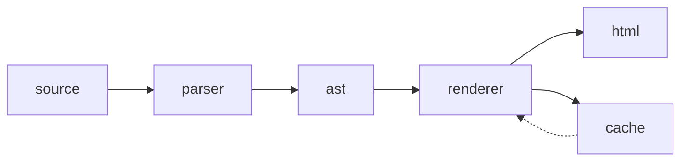
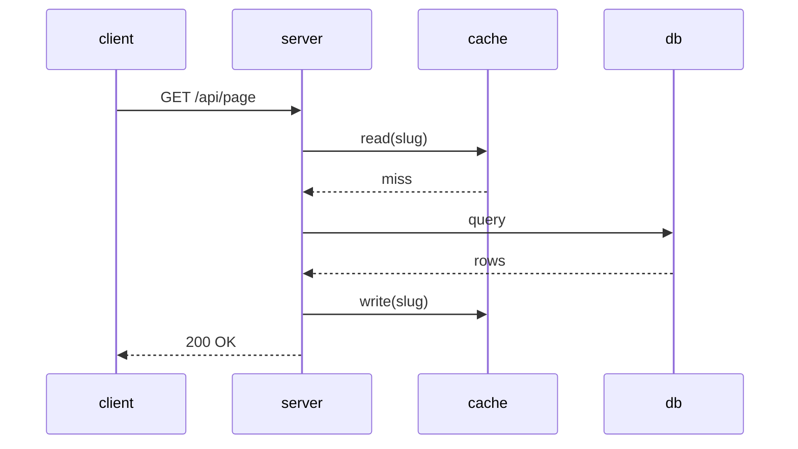
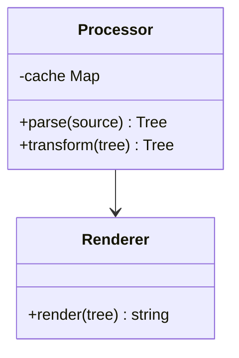

# Markdown Showcase

###### A stress test of every markdown feature worth caring about.[^1]

[^1]: Some features require remark plugins — footnotes come from `remark-gfm`.

## Tables

### Basic

| name     | type      | default | required |
| -------- | --------- | ------- | -------- |
| `id`     | `string`  | —       | yes      |
| `email`  | `string`  | —       | yes      |
| `active` | `boolean` | `true`  | no       |
| `score`  | `number`  | `0`     | no       |

### Wide with alignment

| left-aligned         | center-aligned  |  right-aligned |
| :------------------- | :-------------: | -------------: |
| `adapter-static`     |   prerendered   |      0 ms TTFB |
| `adapter-node`       |     hybrid      |    ~30 ms TTFB |
| `adapter-cloudflare` |   edge + SSR    |     ~5 ms TTFB |
| `adapter-vercel`     | ISR + streaming | ~10–40 ms TTFB |

### Nested content in cells

| feature        | notes                                                                                    |
| -------------- | ---------------------------------------------------------------------------------------- |
| links in cells | [SvelteKit docs](https://kit.svelte.dev) render correctly                                |
| long prose     | Cells wrap naturally; you don't need to worry about overflow on narrower viewport widths |
| **bold**       | and _italic_ and ~~strikethrough~~ all work inside table cells                           |

---

## Code Blocks

### TypeScript

```typescript
type Page = {
	html: string;
	metadata: { title?: string; description?: string };
	raw: string;
	headings: Heading[];
};

async function loadPage(entry: Entry): Promise<Page> {
	const raw = await readRaw(entry);
	const { data: metadata, content } = matter(raw);
	const html = String(await processor.process(content));
	return { html, metadata, raw, headings: extractHeadings(content) };
}
```

### Shell with multiple commands

```bash
# install deps
pnpm install

# dev server
unset GTK_IM_MODULE_FILE && pnpm dev

# production build
pnpm build && pnpm preview
```

### Diff

```diff
- export function getSlugs() {
-   return Object.keys(modules).map(...);
- }
+ export const slugs = Object.keys(modules)
+   .map((p) => p.replace('../../docs/', '').replace(/\.md$/, ''))
+   .map((slug) => ({ slug }));
```

---

## Blockquotes

> This is a simple blockquote.

> **Note:** Blockquotes can contain **bold**, _italic_, `code`, and even other block-level elements.
>
> Like a second paragraph.
>
> > And a nested blockquote inside it.
> >
> > > Nested three levels deep. This is where most renderers start to sweat.

---

## Lists

### Ordered with nesting

1. Install dependencies
   1. Make sure you have Node 20+
   2. Install pnpm globally: `npm i -g pnpm`
   3. Run `pnpm install`
2. Configure your adapter
   - `adapter-static` for fully static output
   - `adapter-node` for a Node server
3. Write your docs in `docs/*.md`
4. Build
   ```bash
   pnpm build
   ```

### Unordered with deep nesting

- Rendering pipeline
  - `pages.ts` reads each `.md` source
    - `gray-matter` splits frontmatter from body
    - `unified` runs the remark → rehype pipeline
      - shiki highlights fenced code at build
      - mermaid blocks render to inline SVG at build
        - SvelteKit prerenders each route to static HTML
  - Tailwind Typography styles the output

### Task list

- [x] markdown pages prerendered to HTML
- [x] raw `.md` source served at `<slug>.md`
- [x] syntax highlighting via shiki
- [x] dark mode
- [x] search
- [ ] versioned docs
- [ ] i18n

---

## Inline Formatting

Here is **bold**, _italic_, ~~strikethrough~~, `inline code`, and a [link](https://svelte.dev).
Hard line break above (two trailing spaces).

Combining them: **_bold italic_**, **~~bold strikethrough~~**, `code` inside **bold context**.

---

## Headings at Every Level

## h2 heading

### h3 heading

#### h4 heading

##### h5 heading

###### h6 heading

---

## Horizontal Rules

Three ways to write one — they all look the same:

---

---

---

---

## Images


With a title attribute:


---

## Footnotes

Footnotes render as superscript links.[^1] Named footnotes work too.[^note]

[^1]: First footnote — plain text.

[^note]: A named footnote. Can contain `code` and **formatting**.

---

## API routes

Highlight an HTTP method + path. Two syntaxes — attributes or inline label.

::route{method=GET path="/api/users"}

::route{method=POST path="/api/users"}

::route{method=PATCH path="/api/users/:id"}

::route{method=DELETE path="/api/users/:id"}

::route[GET /api/short-form]

---

## Admonitions

:::note
Default informational call-out. Works with **markdown** inside.
:::

:::tip
Use tips for forward-looking advice.
:::

:::info[Heads-up]
Override the default heading by putting the label in square brackets after the directive name.
:::

:::warning
Heading for footguns the reader is about to walk into.
:::

:::caution
For risky operations.
:::

:::danger
For irreversible / destructive actions.
:::

---

## Tabs

Switch between equivalent snippets. Tabs that share a `groupId` sync their
selection (persisted in `localStorage`).

::::tabs{groupId="lang"}

::tab[curl]

```sh
curl -X POST https://api.example.com/v1/items \
  -H "Authorization: Bearer $TOKEN" \
  -d '{"name":"thing"}'
```

::tab[js]

```js
await fetch('https://api.example.com/v1/items', {
	method: 'POST',
	headers: { Authorization: `Bearer ${token}` },
	body: JSON.stringify({ name: 'thing' }),
});
```

::tab[python]

```python
requests.post(
    "https://api.example.com/v1/items",
    headers={"Authorization": f"Bearer {token}"},
    json={"name": "thing"},
)
```

::::

Tabs combine with per-block `title="..."` — the title bar tucks under the
selected tab so the active tab visually "opens" into its file:

::::tabs{groupId="lang"}

::tab[curl]

```sh title="request.sh"
curl https://api.example.com/v1/items/42
```

::tab[js]

```js title="request.js"
const res = await fetch('https://api.example.com/v1/items/42');
```

::tab[python]

```python title="request.py"
requests.get("https://api.example.com/v1/items/42")
```

::::

---

## Code annotations

### Line highlight via meta

```ts {2-3}
function noop() {}
function add(a: number, b: number) {
	return a + b;
}
function done() {}
```

### Line highlight via magic comment

```ts
function noop() {}
function add(a: number, b: number) {
	return a + b; // [!code highlight]
}
```

### Diff notation

```ts
function noop() {}
function removed() {} // [!code --]
function added() {} // [!code ++]
```

### Title bar

```ts title="src/lib/server/content/processor.ts"
import { unified } from 'unified';

const processor = unified().use(remarkParse).use(remarkGfm);
```

### Line numbers

```ts {showLineNumbers}
function noop() {}
function add(a: number, b: number) {
	return a + b;
}
function done() {}
```

### Line numbers with title and highlight

```ts {2-3} title="src/lib/math.ts" {showLineNumbers}
function noop() {}
function add(a: number, b: number) {
	return a + b;
}
function done() {}
```

### Inline highlighting

The runtime function `fetch(url){:js}` returns a Promise, while `let mut x: i32 = 0;{:rust}` declares a mutable binding. Languages render with the same dual-theme tokens as fenced blocks.

---

## Math

Inline math like $E = mc^2$ flows with the surrounding text, and the Pythagorean identity $a^2 + b^2 = c^2$ renders alongside prose.

Display math is rendered as a centered block:

$$
\int_{-\infty}^{\infty} e^{-x^2}\, dx = \sqrt{\pi}
$$

$$
\frac{\partial}{\partial t}\,\psi(\mathbf{r}, t) = -\frac{i}{\hbar}\,\hat{H}\,\psi(\mathbf{r}, t)
$$

Wrap an equation in `:::equation[caption]` to render it as a captioned figure:

:::equation[Gauss's law for electromagnetism, in differential form]

$$
\nabla \cdot \mathbf{E} = \frac{\rho}{\varepsilon_0}
$$

:::

---

## Diagrams

Mermaid diagrams render to inline SVG at build time.

### Flow



### Sequence



### Class


